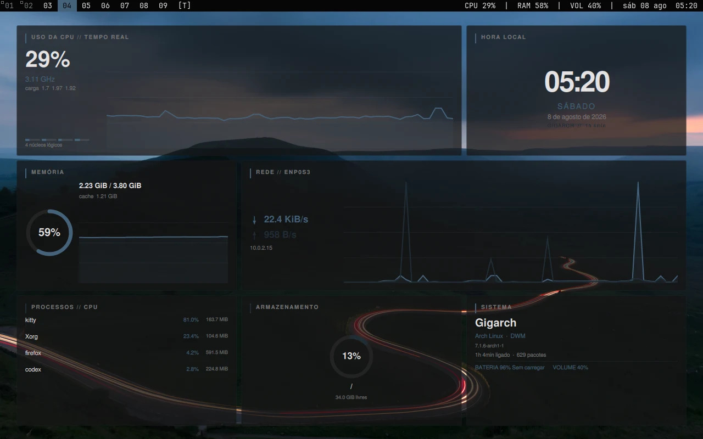
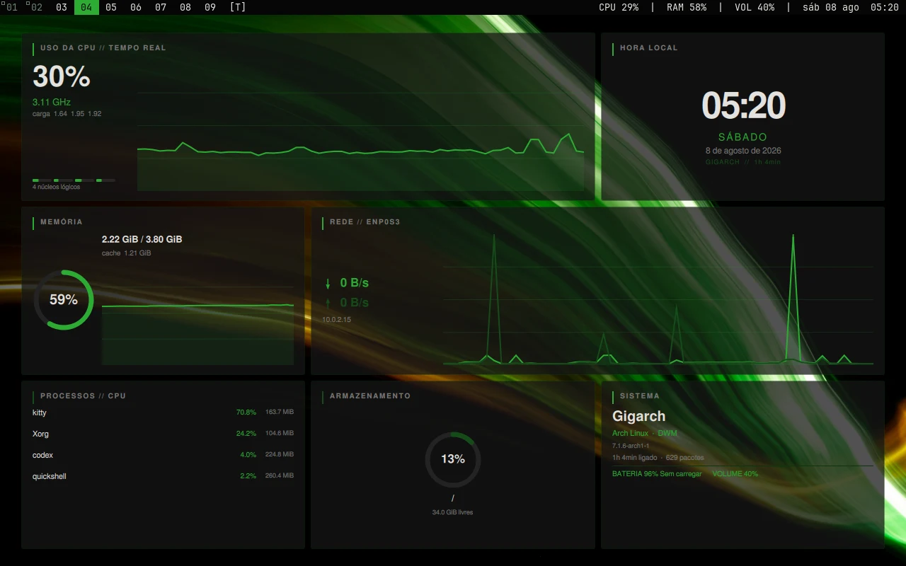
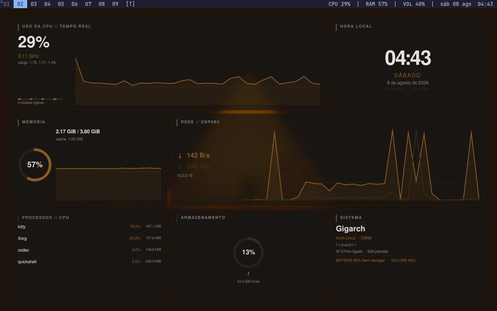

# kdwm

> Kristyan's DWM — a dark, Matugen-powered DWM environment with a live Quickshell system dashboard.

[](LICENSE)
[](https://archlinux.org/)
[](https://dwm.suckless.org/)
[](https://quickshell.org/)
[](https://github.com/InioX/matugen)
[](https://www.x.org/)

## Overview

`kdwm` is a focused Arch Linux/X11 desktop built around a patched DWM 6.8 source package. It combines DWM's tiling model with a transparent Quickshell dashboard, restrained wallpaper-derived colors, runtime bar and client-border recoloring, Kitty, Rofi, and Picom.

The project ships its own DWM base and patchset. It does not attempt to inject patches into arbitrary third-party DWM trees.

## Features

- Matugen-authoritative wallpaper palette with a mostly monochromatic semantic layer
- live DWM bar, tag, selected-border, and inactive-border reload through `SIGUSR1`
- existing clients recolored without restarting DWM or the X11 session
- 10 px inner and outer DWM gaps, including single-client layouts
- persistent Quickshell dashboard with CPU, memory, network, storage, process, sensor, battery, audio, Bluetooth, and supported NVIDIA GPU telemetry
- real-time resource graphs and PT-BR interface/date formatting
- Rofi application and wallpaper launchers driven by the same generated semantic palette
- Kitty palette reload, Picom transparency, and Wallhaven wallpaper management
- timestamped backups and idempotent repository-backed configuration deployment

## Preview

All previews are captures of the running `kdwm` session. Layout and neutral surfaces remain stable while Matugen changes the accent identity.

### Graphite + steel blue



Wallpaper: [Wallhaven xedo8v](https://whvn.cc/xedo8v). Semantic accent: `#44627b`.

### Graphite + green



Wallpaper: [Wallhaven kxdky1](https://whvn.cc/kxdky1). Semantic accent: `#2cab33`.

### Graphite + amber



Wallpaper: [Wallhaven o5e9w9](https://whvn.cc/o5e9w9). Semantic accent: `#8b5a24`.

## Requirements

Tested and supported on:

- Arch Linux
- X11
- DWM 6.8 as packaged by this repository
- an xsession-capable display manager or `startx`
- a normal non-root desktop user with `sudo` access for package installation

The installer uses official Arch packages and currently expects `base-devel`, `libx11`, `libxinerama`, `libxft`, `freetype2`, `rofi`, `quickshell`, `kitty`, `picom`, `feh`, `jq`, `curl`, `python`, `matugen`, and JetBrains Mono. Audio and Bluetooth indicators use `wpctl` and `bluetoothctl` when those commands are present. NVIDIA telemetry uses `nvidia-smi` when available.

Other distributions, Wayland, and heavily patched external DWM trees are not supported by the installer.

## Installation

Clone the configured upstream repository into any writable location:

```bash
git clone https://github.com/kristyancarvalho/dwm-dotfiles.git kdwm
cd kdwm
sudo ./install.sh
```

When root cannot infer the intended desktop account, pass it explicitly:

```bash
sudo ./install.sh --user alice
```

Available focused options:

```text
--user USER
--no-packages
--no-wallpaper
--no-quickshell
--no-kitty
--dry-run
```

The installer detects the checkout path and target home, reports an existing DWM package and common desktop configuration, installs only missing packages, builds DWM as the target user, and installs the resulting package as root. `makepkg` and AUR helpers are never run as root. Matugen is currently available as an official Arch package; if that changes, install it manually as the desktop user before using `--no-packages`.

Conflicts under the target home are moved to:

```text
~/.local/state/kdwm/backups/YYYYMMDDHHMMSS/
```

Conflicting system command paths or the `kdwm` XSession entry are moved to:

```text
/var/lib/kdwm/backups/YYYYMMDDHHMMSS/
```

The installer preserves an unrelated `dwm.desktop` entry and unrelated DWM source/config directories. Re-running it with the same checkout is idempotent.

## Architecture

```text
kdwm/
├── dwm/          DWM 6.8 config and ordered patches
├── quickshell/   PT-BR dashboard and reusable visual components
├── scripts/      session, metrics, wallpaper, launcher, and theme tools
├── rofi/         semantic launcher layout
├── kitty/        terminal configuration
├── picom/        compositor configuration
├── wallpaper/    provider catalog
├── config/       GTK, Qt, and environment settings
├── system/       kdwm XSession entry
└── docs/images/  optimized real-session previews
```

Runtime state is kept outside the checkout:

```text
~/.cache/kdwm/
├── theme/        semantic JSON, Xresources, Rofi, Kitty, and Matugen output
├── wallpapers/   downloaded images and provider index
├── state/        current wallpaper, telemetry snapshot, and change marker
└── logs/         Quickshell startup output
```

## Theme pipeline

```text
wallpaper
  → Matugen scheme-neutral extraction
  → kdwm dark semantic normalization
  ├── Xresources → DWM bar, tags, and client borders
  ├── theme.json → Quickshell
  ├── rofi-colors.rasi → Rofi
  └── kitty-colors.conf → Kitty
```

Matugen is the only palette generator. `scripts/generate-theme` also writes `~/.cache/wal/colors.json` as a compatibility artifact for tools that understand Pywal's cache format; Pywal is not run and is not required.

DWM's `SIGUSR1` handler only marks a reload request. Its normal event loop reads the updated Xresources database, recreates drawing schemes, redraws every bar, and calls `XSetWindowBorder` for every managed client. Wallpaper changes therefore require no DWM, X11, SDDM, or login restart.

## Wallpaper management

```bash
kdwm-wallpaper refresh
kdwm-wallpaper select
kdwm-wallpaper random
kdwm-wallpaper set /path/to/image
kdwm-wallpaper list
kdwm-wallpaper current
```

`Alt+w` opens the themed selector. The default provider/search is configured in `wallpaper/sources.json`. The release default is [Wallhaven xedo8v](https://whvn.cc/xedo8v), a low-complexity dark road composition that leaves the dashboard visually dominant.

## Keybindings

| Binding | Action |
| --- | --- |
| `Alt+p` | Open the fuzzy Rofi application launcher |
| `Alt+w` | Open the wallpaper selector |
| `Alt+Shift+Enter` | Open Kitty |
| `Alt+j` / `Alt+k` | Focus next/previous client |
| `Alt+h` / `Alt+l` | Change master width |
| `Alt+Shift+h` / `Alt+Shift+l` | Decrease/increase gaps |
| `Alt+t` / `Alt+f` / `Alt+m` | Tiled/floating/monocle layout |
| `Alt+1..9` | View tag |
| `Alt+Shift+1..9` | Move client to tag |
| `Alt+b` | Toggle the DWM bar |
| `Alt+Shift+r` | Targeted DWM restart |
| `Alt+Shift+q` | End DWM |

## Customization

- Dashboard layout and labels: `quickshell/shell.qml`
- Dashboard cards and graphs: `quickshell/components/`
- Semantic derivation: `scripts/generate-theme`
- Wallpaper source/query: `wallpaper/sources.json`
- Gaps, rules, tags, and keybindings: `dwm/config.h`
- DWM source changes: `dwm/patches/`
- Launcher geometry: `rofi/kdwm.rasi`
- Transparency: `picom/picom.conf` and `kitty/kitty.conf`

Changes to `dwm/config.h` or patches require rebuilding with `sudo ./install.sh --user USER`. Palette and wallpaper changes do not.

## Troubleshooting

### Matugen is missing

Install `matugen`, then run `kdwm-wallpaper set /path/to/image`. The command intentionally refuses to create competing fallback palettes.

### Colors changed in Quickshell but not DWM

Confirm `xrdb -query | grep '^dwm\.'` returns colors and `/usr/bin/dwm` comes from the `kdwm` package build. Then send `pkill -USR1 -x dwm`; no restart should be necessary.

### Rofi reports a theme parser error

Regenerate the cache with `kdwm-wallpaper set /path/to/image`, then validate with `rofi -no-config -theme ~/.config/rofi/kdwm.rasi -dump-theme`.

### Quickshell shows no metrics

Inspect `~/.cache/kdwm/logs/quickshell.log`, verify `quickshell` is installed, and run `~/.local/share/kdwm/scripts/system-stats-daemon` directly. Device-specific metrics disappear cleanly when their supporting tools or hardware are unavailable.

### The checkout moved

Run `sudo ./install.sh --user USER` again so repository-backed links and stable `kdwm-*` commands point to the new location.

## Contributing

See [CONTRIBUTING.md](CONTRIBUTING.md) for branch, commit, validation, and patch expectations.

## License

The original `kdwm` configuration, integration scripts, and documentation are available under the [MIT License](LICENSE). The bundled build downloads upstream DWM 6.8 and preserves its MIT license. DWM, Quickshell, Matugen, Kitty, Rofi, Picom, Arch Linux, and wallpaper works remain the property of their respective authors and retain their own licenses or usage terms.
